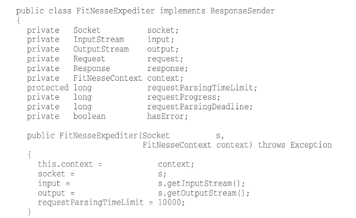

# Clean Code

## Meaningful Names

The name of a variable, function, or class, should answer all the big questions. **It should tell you why it exists, what it does, and how it is used**. If a name requires a comment, then the name does not reveal its intent.

`int d; // elapsed time in days`

In this case, d not reveals nothing.

Example of code without meaningful names

```java
public List<int[]> getThem() {
   List<int[]> list1 = new ArrayList<int[]>();
   for (int[] x : theList)
      if (x[0] == 4)
         list1.add(x);

   return list1;
}
```

vs

Example of code with meaningful names

```java
public List<int[]> getFlaggedCells() {
   List<int[]> flaggedCells = new ArrayList<int[]>();
   for (int[] cell : gameBoard)
      if (cell[STATUS_VALUE] == FLAGGED)
         flaggedCells.add(cell);
   return flaggedCells;
}
```

### Avoid Disinformation

Avoid leaving false clues that obscure the meaning of code. Do not refer to a grouping of accounts as an accountList unless it’s actually a List.

```java
List<Account> accountList = new ArrayList(); // This is not good

List<Account> accounts = new ArrayList(); // This is good
```

_"Spelling similar concepts similarly is information. Using inconsistent spellings is dis-
information."_\

If names must be different, then they should also mean something different. So **pick one word per concept.**

```java
public int calculateCost(String location){

   int artistMoney = this.artist.calculatePrice();
   int locationCash = this.search(location).calculateCharge();

   return artistMoney + locationCash
}
```

In this case, cost, price, money, cash, charge means the same so they must have the same name so that it keeps the code simple and concise

```java
public int calculateCost(String location){

   int artistCost = this.artist.calculateCost();
   int locationCost = this.search(location).calculateCost();

   return artistCost + locationCost
}
```

### Use Pronounceable Names

If you can’t pronounce it, you can’t discuss it without sounding like an idiot.

How can be possible to guess that `genymdhms` means generation date, year, month, day, hour, minute, and second ? **Impossible**

So what would a better name be?

```java
class DtaRcrd102 {
   private Date genymdhms;
   private Date modymdhms;
   private final String pszqint = "102";
   /* ... */
};

to

class Customer {
   private Date generationTimestamp;
   private Date modificationTimestamp;;
   private final String recordId = "102";
   /* ... */
};

```

### Use Searchable Names

Single-letter names can ONLY be used as local vari-
ables inside short methods._"The length of a name should correspond to the size of its scope"_.

If a variable or constant might be seen or used in multiple places in a body of code,
it is imperative to give it a search-friendly name.

```java
for (int j=0; j<34; j++) {
   s += (t[j]*4)/5;
}

to

const int WORK_DAYS_PER_WEEK = 5;
int realDaysPerIdealDay = 4;
int sum = 0;

for (int j=0; j < NUMBER_OF_TASKS; j++) {
   int realTaskDays = taskEstimate[j] * realDaysPerIdealDay;
   int realTaskWeeks = (realdays / WORK_DAYS_PER_WEEK);
   sum += realTaskWeeks;
}
```

### Interfaces and Implementations

Don't use IInterface, just Interface

When you are using some known pattern, it is good to chose a name for the variables that represents the patter that is it used.

Remember that the people who read your code will be programmers. So go ahead and use
computer science (CS) terms, algorithm names, pattern names, math terms, and so forth.

```java
// If we are using a Abstract Factory
class UserFactory

// If we are using a Singleton
class LoggeerSingleton

//means a great deal to a programmer who is familiar with the VISITOR pattern.
class AccountVisitor
```

### Classes and objects

Classes and objects should have noun or noun phrase names like `Customer, WikiPage,
Account, and AddressParser`. Avoid words like `Manager, Processor, Data, or Info` in the name
of a class. A class name should not be a verb.

### Methods

Should have verb or verb phrase names like `postPayment, deletePage, or save`.

Accessors, mutators, and predicates should be named for their value and prefixed with `get`,
`set`, and `is`.

## Functions

### Small!

The first rule of functions is that they should be small. _The second rule of functions is that
they should be smaller than that_.

**Functions should hardly ever be 20 lines long.**

### Blocks and Indenting

The blocks within if statements, else statements, while statements if they are one line long, {} must be avoid

```c#
if number % 2 == 0 ? return 'pair': return 'odd';

if (number % 2 == 0){
   return 'pair';
}else{
   return 'odd';
}
```

### Do One Thing

**FUNCTIONS SHOULD DO ONE THING. THEY SHOULD DO IT WELL.
THEY SHOULD DO IT ONLY.**

We can describe the function by describing it as a brief TO4 paragraph:\
_TO RenderPageWithSetupsAndTeardowns, we check to see whether the page is a test page
and if so, we include the setups and teardowns. In either case we render the page in
HTML._

If a function does only those steps that are one level below the stated name of the
function, then the function is doing one thing.

### Reading Code from Top to Bottom: The Stepdown Rule

We want the code to read like a top-down narrative.5 We want every function to be fol-
lowed by those at the next level of abstraction so that we can read the program, descending one level of abstraction at a time as we read down the list of functions.

To say this differently, we want to be able to read the program as though it were a set
of TO paragraphs, each of which is describing the current level of abstraction and refer-
encing subsequent TO paragraphs at the next level down.

> To include the setups and teardowns, we include setups, then we include the test page con- tent, and then we include the teardowns.
>
> > To include the setups, we include the suite setup if this is a suite, then we include the regular setup.\
> > To include the suite setup, we search the parent hierarchy for the “SuiteSetUp” page and add an include statement with the path of that page.\
> > To search the parent. . .

### Switch Statements

We can make sure that each switch statement is buried in a low-level class and is never repeated.

```java
public Money calculatePay(Employee e) throws InvalidEmployeeType {
   switch (e.type) {
      case COMMISSIONED:
         return calculateCommissionedPay(e);
      case HOURLY:
         return calculateHourlyPay(e);
      case SALARIED:
         return calculateSalariedPay(e);
      default:
         throw new InvalidEmployeeType(e.type);
   }
}
```

But switch statements are not recommended as they violates SR because there is more than one reason for it to change, OC because it must change whenever new types are added

The best thing to do is encapsulate this switch within a Factory

```java
public abstract class Employee {
   public abstract boolean isPayday();
   public abstract Money calculatePay();
   public abstract void deliverPay(Money pay);
}
-----------------
public interface EmployeeFactory {
   public Employee makeEmployee(EmployeeRecord r) throws    InvalidEmployeeType;
   }
-----------------
public class EmployeeFactoryImpl implements EmployeeFactory {

   public Employee makeEmployee(EmployeeRecord r) throws   InvalidEmployeeType {
      switch (r.type) {
         case COMMISSIONED:
            return new CommissionedEmployee(r) ;
         case HOURLY:
            return new HourlyEmployee(r);
         case SALARIED:
            return new SalariedEmploye(r);
         default:
            throw new InvalidEmployeeType(r.type);
      }
   }
}
```

Remember Ward’s principle: _“You know you are working on clean code when each routine turns out to be pretty much what you expected.”_

### Function Arguments

The ideal number of arguments for a function is zero (**niladic**). Next comes one (**monadic**), followed closely by two (**dyadic**). Three arguments (**triadic**) should be avoided where possible. More than three (**polyadic**) requires very special justification.

### Flag Arguments

Passing a boolean into a function is a truly terrible practice. It immediately complicates the signature of the method, loudly proclaiming that this function does more than one thing. It does one thing if the flag is true and another if the flag is false!

The method call `render(true)` is just plain confusing to a poor reader. Always names must be positive `render(boolean isSuite)` helps a little,

### Argument Objects

When a function seems to need more than two or three arguments, it is likely that some of those arguments ought to be wrapped into a class of their own.

```java
Circle makeCircle(double x, double y, double radius);
Circle makeCircle(Point center, double radius);
```

When groups of variables are passed together, the way x and
y are in the example above, they are likely part of a concept that deserves a name of its own.

### Extract Try/Catch Blocks

Try/catch blocks are ugly in their own right. They confuse the structure of the code and mix error processing with normal processing.

```java
public void delete(Page page) {
   try {
      deletePageAndAllReferences(page);
   }
   catch (Exception e) {
      logError(e);
   }
}

private void deletePageAndAllReferences(Page page) throws   Exception {
   deletePage(page);
   registry.deleteReference(page.name);
   configKeys.deleteKey(page.name.makeKey());
}

private void logError(Exception e) {
   logger.log(e.getMessage());
}
```

### Error Codes

Returning error codes usually implies that there is some class or enum in which all the error codes are defined.

```java
public enum Error {
   OK,
   INVALID,
   NO_SUCH,
   LOCKED,
   OUT_OF_RESOURCES,
   WAITING_FOR_EVENT;
}
```

## Comments

> “Don’t comment bad code—rewrite it.” —Brian W. Kernighan and P. J. Plaugher

The proper use of comments is to compensate for our failure to express ourself in code. Comments are always failures. We must have them because we cannot always figure out how to express ourselves without them, but their use is not a cause for celebration.

### Explain Yourself in Code

```java
// Check to see if the employee is eligible for full benefits
if ((employee.flags & HOURLY_FLAG) &&
   (employee.age > 65))

Or this?

if (employee.isEligibleForFullBenefits())
```

### Good Comments

Copyright and authorship statements are necessary and reasonable things to put into a comment at the start of each source file.

```java
// format matched kk:mm:ss EEE, MMM dd, yyyy
Pattern timeMatcher = Pattern.compile(
"\\d*:\\d*:\\d* \\w*, \\w* \\d*, \\d*");
```

In this case the comment lets us know that the regular expression is intended to match a time and date that were formatted with the SimpleDateFormat.format function using the
specified format string.

Sometimes a comment goes beyond just useful information about the implementation and provides the intent behind a decision. In the following case we see an interesting decision
documented by a comment.

```java
public int compareTo(Object o)
{
   if(o instanceof WikiPagePath) {
      WikiPagePath p = (WikiPagePath) o;
      String compressedName = StringUtil.join(names, "");
      String compressedArgumentName = StringUtil.join(p.names, "");
      return compressedName.compareTo(compressedArgumentName);
   }
   return 1; // we are greater because we are the right type.
}
```

Sometimes it is useful to warn other pro-
grammers about certain consequences. For example, here is a comment that explains why a particular test case is turned off:

```java
// Don't run unless you
// have some time to kill.
public void _testWithReallyBigFile()
{
   writeLinesToFile(10000000);
   response.setBody(testFile);
   response.readyToSend(this);
   String responseString = output.toString();
   assertSubString("Content-Length: 1000000000", responseString);
   assertTrue(bytesSent > 1000000000);
}
```

### TODO Comments

The TODO comment explains why the function has a degenerate implementation and what that function’s future should be.TODOs are jobs that the programmer thinks should be done, but for some reason can’t do at the moment.

Whatever else a TODO might be, it is not an excuse to _leave bad code_ in the system.

### Bad Comments

Redundant comments, that the code itself tells is considered bad comments

```java
// Utility method that returns when this.closed is true. Throws an exception
// if the timeout is reached.
public synchronized void waitForClose(final long timeoutMillis)
throws Exception
{
   if( !closed )
   {
      wait(timeoutMillis);
      if( !closed )
         throw new Exception("MockResponseSender could not be closed");
   }
}
```

Sometimes you see comments that are nothing but noise. They restate the obvious and
provide no new information.

```java
/** The day of the month. */
private int dayOfMonth;
```

What is the pourpose of this!!!

It is good to follow this rule --> **Don’t Use a Comment When You Can Use a Function or a Variable**

Sometimes programmers like to mark a particular position in a source file. For example, I
recently found this in a program I was looking through:

```java
// Actions //////////////////////////////////
```

There are rare times when it makes sense to gather certain functions together beneath a
banner like this. But in general they are clutter that should be **eliminated**.

Commented-Out Code -> TERRIBLE
Consider this from apache commons:

```java
this.bytePos = writeBytes(pngIdBytes, 0);
//hdrPos = bytePos;
writeHeader();
writeResolution();
//dataPos = bytePos;
if (writeImageData()) {
   writeEnd();
   this.pngBytes = resizeByteArray(this.pngBytes, this.maxPos);
}
else {
   this.pngBytes = null;
}
return this.pngBytes;
```

Why are those two lines of code commented? Are they important? Were they left as
reminders for some imminent change? Or are they just cruft that someone commented-out
years ago and has simply not bothered to clean up.

## Formating

Code formatting is important. It is too important to ignore and
it is too important to treat religiously. Code formatting is about communication, and
communication is the professional developer’s first order of business.\
The coding style and readability set precedents that continue to affect maintainability and extensibility long after the original code has been changed beyond recognition. Your style and discipline survives, even though your code does not.

Consider the importance of respecting one blank line after each method

```java
package fitnesse.wikitext.widgets;

import java.util.regex.*;

public class BoldWidget extends ParentWidget {

   public static final String REGEXP = "'''.+?'''";
   private static final Pattern pattern = Pattern.compile("'''(.+?)'''", Pattern.MULTILINE + Pattern.DOTALL );

   public BoldWidget(ParentWidget parent, String text) throws Exception {
      super(parent);
      Matcher match = pattern.matcher(text);
      match.find();
      addChildWidgets(match.group(1));
   }

   public String render() throws Exception {
      StringBuffer html = new StringBuffer("<b>");
      html.append(childHtml()).append("</b>");
      return html.toString();
   }
}
```

And

```java
package fitnesse.wikitext.widgets;
import java.util.regex.*;
public class BoldWidget extends ParentWidget {
   public static final String REGEXP = "'''.+?'''";
   private static final Pattern pattern = Pattern.compile("'''(.+?)'''", Pattern.MULTILINE + Pattern.DOTALL );
   public BoldWidget(ParentWidget parent, String text) throws Exception {
      super(parent);
      Matcher match = pattern.matcher(text);
      match.find();
      addChildWidgets(match.group(1));
   }
   public String render() throws Exception {
      StringBuffer html = new StringBuffer("<b>");
      html.append(childHtml()).append("</b>");
      return html.toString();
   }
}
```

This effect is even more pronounced when you unfocus your eyes.

### Horizontal Alignment


